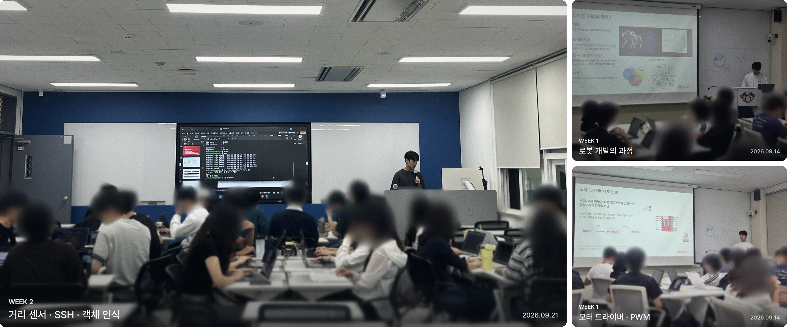
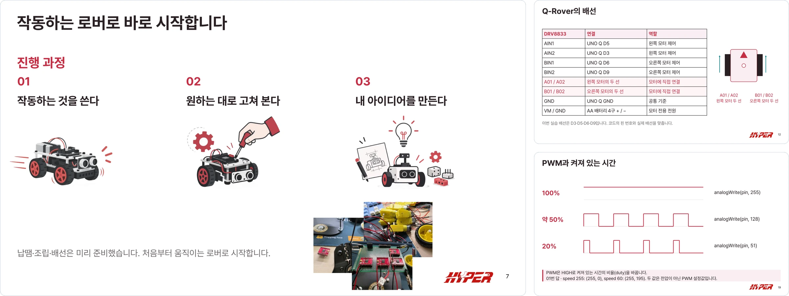
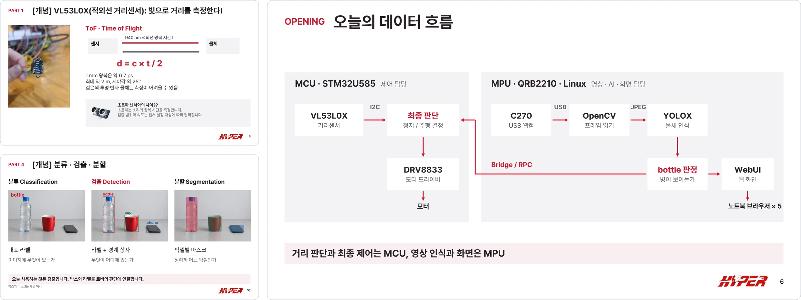
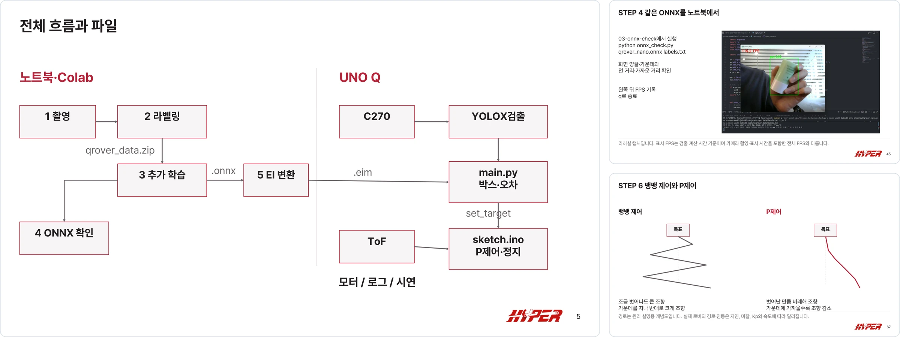

# Q-Rover 세미나

**HYPER 교육부 · 2026년 2학기**

Arduino UNO Q로 로버를 직접 만들면서 모터 제어, 리눅스, 센서, 카메라 인식을 3주 동안 진행하는 과정입니다.



<sub>전자공학과 · 컴퓨터공학과 · 소프트웨어융합학과 · 기계공학과 외 여러 학과 1~3학년 27명이 함께했습니다.</sub>

- 스터디장 · [정여은](https://github.com/yeoniix)
- 강의 · [박성호](https://github.com/emjdp)
- Special Thanks · [HJ1-1101](https://github.com/HJ1-1101) · [Anhyeonseo](https://github.com/Anhyeonseo) · [HYPER-Robotics](https://github.com/HYPER-Robotics)

## 주차별 내용

### 1주차 · 움직이기 <sub>09.14</sub>

DRV8833 모터 드라이버를 배선하고, H-브리지와 PWM으로 전진·급정지·제자리 회전을 만듭니다.



[슬라이드](week1/slides/Q-ROVER_1차시_HYPER_최종.pdf) · [실습](week1/labs/q-rover-01)

### 2주차 · 보고 멈추기 <sub>09.21</sub>

거리 센서와 카메라 객체 인식을 Bridge로 묶어, 20cm 안에 장애물이 있거나 병이 보이면 멈춥니다. SSH로 보드 안의 리눅스도 들여다봅니다.



[슬라이드](week2/slides/Q-ROVER_2차시_HYPER_최종.pdf) · [거리 센서](week2/labs/tof-sensor) · [통합 미션](week2/labs/q-rover-02)

### 3주차 · 따라가기 <sub>10.05 ~ 11.02 · 팀별 자율 진행</sub>

팀마다 정한 물체를 찍고 라벨링해서 YOLOX-Nano를 학습시킵니다. 로버는 P제어로 방향을 잡으며 물체를 따라가다 15cm 앞에서 멈춥니다.



[슬라이드](week3/slides/Q-ROVER_3차시_HYPER_최종.pdf) · [실습](week3/labs) · [공통 미션](week3/labs/q-rover-03) · [App Lab용 zip](week3/labs/q-rover-03.zip)

## 코드 받기

```bash
git clone https://github.com/emjdp/q-rover.git
```

git이 없으면 이 페이지 위쪽 **Code → Download ZIP**으로 받아도 됩니다.

슬라이드 PDF는 `weekN/slides/`, 실습 코드는 `weekN/labs/`에 있고, `app.yaml`이 있는 폴더 하나가 App Lab 앱 하나입니다. 원본 PPT는 [Releases](https://github.com/emjdp/q-rover/releases)에서 받을 수 있습니다.

보드 계정은 `arduino` / `hyper123`입니다.
